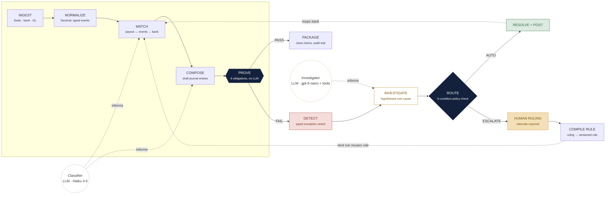
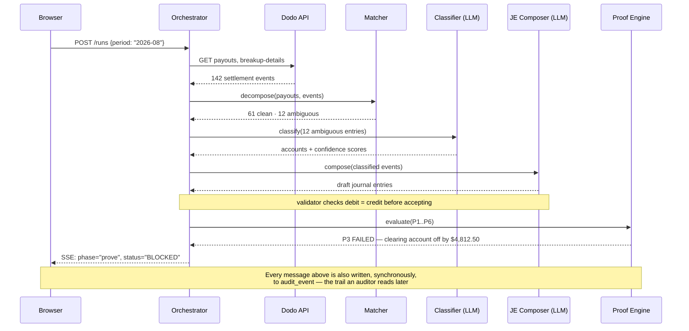
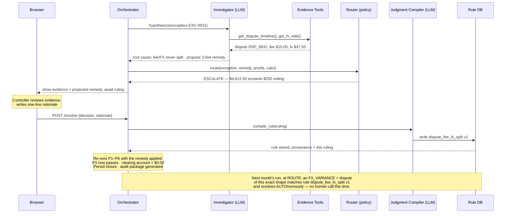

# TieOut — Implementation Plan

**Goal:** Build a close agent that decomposes merchant-of-record settlement payouts into
journal entries, refuses to close a period until a deterministic proof engine confirms the
clearing account is empty, investigates and routes exceptions, and compiles human rulings
into reusable rules.

**Architecture:** A deterministic state-machine spine (Ingest → Normalize → Match → Compose
→ Prove → Package) with two narrow LLM call-outs (Classifier, Investigator) that inform
specific steps but never sit on the spine itself. Every path an LLM output takes back onto
the spine is re-checked by the Proof Engine before anything is allowed to post.

**Tech stack:** Python 3.12 + FastAPI, Postgres (local Docker) via SQLAlchemy 2.0 +
Alembic, sponsor LLM APIs (gpt-5-nano for investigation, GLM-4.7-flash for classification, 
text-embedding-3-small for semantic search), Next.js 15 + Tailwind + shadcn/ui + Recharts, 
Server-Sent Events for the live run feed, Neatlogs SDK for tracing, Dodo Payments test mode 
as the settlement data source.

**Spec:** [`01-chart-of-accounts.md`](01-chart-of-accounts.md),
[`02-exception-taxonomy.md`](02-exception-taxonomy.md),
[`03-data-model-and-contracts.md`](03-data-model-and-contracts.md),
[`04-demo-script.md`](04-demo-script.md), and the strategy in
`role-you-are-cryptic-noodle.md` — this plan is how those specs get built.

## Global constraints

- **No floats, anywhere.** Every monetary value is Python `Decimal` and Postgres
  `NUMERIC(18,4)`, serialized to JSON as a string, never a number.
- **A language model never computes a final dollar amount.** Only the deterministic engine
  does. LLMs classify, hypothesize, draft structure, and narrate — never arithmetic.
- **Nothing posts to the ledger without a passing proof**, and a period cannot close while
  the clearing account is unproven.
- **Every autonomous action is reversible and attributed** to whoever or whatever made it
  (`agent` / `human` / `rule`).
- **The schema and the three contracts (handler, proof, API) freeze at hour 2.** Everything
  after that builds against them without renegotiating.
- **Official window: September 5, 2026, 9:30 PM IST → September 7, 2026, 3:30 AM IST — 30
  hours exactly.** All hour offsets below (H0–H30) are relative to that start.
- **Submission is Devpost, not Discord or GitHub alone** — see [§9](#9-submission-checklist)
  for the exact required fields and the README content organizers will check.

---

## 1. The mechanism, in one paragraph

Money arrives from Dodo as one lump payout. TieOut decomposes it, drafts journal entries,
and then runs a check that either lands on exactly zero or doesn't — that check, not the
AI, decides whether the period closes. Every component below exists to feed that check good
information, or to fix what it flags.

## 2. Architecture

TieOut is a **state machine with LLM calls embedded in specific, narrow steps** — not an LLM
deciding what to do next. The orchestrator always knows exactly which phase a run is in.



**Reading the diagram:** the spine (Ingest → Normalize → Match → Compose → Prove → Package)
is entirely deterministic. Two LLMs sit off the spine, connected by dotted "informs" edges:
the Classifier feeds Match and Compose, the Investigator only activates when Prove fails.
No LLM has an edge straight into Package or the ledger — every path back onto the spine
passes through Prove again. That's deliberate: nothing an LLM touches reaches the books
without being re-checked by arithmetic.

### 2.1 Components

| Component | Type | Does | Cannot do |
|---|---|---|---|
| **Close Orchestrator** | State machine | Tracks which phase a run is in, moves it forward | Skip a failed proof; close a blocked period |
| **Ingestor** | Tool | Pulls settlement events from Dodo, bank lines, GL, invoices into one shared shape | Mutate source data |
| **Matcher** | Deterministic engine | Decomposes a payout into its parts, ties it to a bank deposit | Call a model for any arithmetic |
| **Classifier** | LLM · GLM-4.7-flash | Assigns a GL account to ambiguous events, with a confidence score | Invent an account or an amount |
| **JE Composer** | LLM + validator | Drafts journal-entry structure | Post an entry that doesn't balance — a separate validator rejects it first |
| **Proof Engine** | Deterministic engine | Runs the six proof obligations (P1–P6) | Be overridden by any agent |
| **Investigator** | LLM · gpt-5-nano + tools | Forms hypotheses, calls evidence tools, cites a root cause | Edit data; assert an unverified number |
| **Escalation Router** | Policy engine | A six-condition check decides autonomous-resolve vs. escalate | Auto-approve above materiality |
| **Judgment Compiler** | LLM + schema check | Turns a human ruling into a versioned, reusable rule | Change a materiality threshold or a proof |
| **Narrator** | Prose generation (internal or simple API) | Writes the close memo in prose | State a figure not sourced from the ledger |

### 2.2 Hard invariants

1. A language model never computes a final dollar amount — only the deterministic engine does.
2. Nothing posts to the ledger without a passing proof.
3. A period cannot close while the clearing account is unproven.
4. Every autonomous action is reversible and attributed to who or what made it.

### 2.3 The exact autonomy check

This is the one piece of logic the whole trust story rests on — a plain function, not a prompt:

```python
def route(exception, remedy, proofs, rules) -> Literal["AUTO", "ESCALATE"]:
    return "AUTO" if all([
        all(p.passed for p in proofs if p.blocking),                  # 1. every proof still passes
        abs(exception.amount) < Decimal("250.00"),                    # 2. under materiality
        exception.confidence >= Decimal("0.85"),                      # 3. classifier is sure
        rules.has_match(exception) or exception.is_known_archetype,   # 4. seen before
        not remedy.touches_restricted_account,                        # 5. no restricted account
        not rounding_cap_breached(remedy),                            # 6. hasn't hit the cap
    ]) else "ESCALATE"
```

All six, every time. One false and it stops and asks a human — never the reverse.

---

## 3. Tech stack

Chosen for two things only: money must never touch a float, and the demo must survive a
dead network connection.

| Layer | Choice |
|---|---|
| Backend | Python 3.12 · FastAPI |
| Money | `Decimal` / `NUMERIC(18,4)` |
| Database | Postgres (local, Docker) |
| ORM | SQLAlchemy 2.0 + Alembic |
| Frontend | Next.js 15 + Tailwind |
| Components | shadcn/ui + Recharts |
| Live feed | Server-Sent Events |
| Observability | Neatlogs SDK |
| Data source | Dodo Payments (test mode) |

### Models per pipeline stage

| Stage | Model | Provider | Rationale |
|---|---|---|---|
| **Investigator** (exception root-cause) | gpt-5-nano | OpenAI | Reasoning capability for hypothesis formation and evidence citation; reasoning-focused model well-suited for financial investigation |
| **Classifier** (GL account assignment) | GLM-4.7-flash | TensorMux (OpenAI-compatible) | High-volume, low-stakes classification; free sponsor API (50M tokens); extraction and summarization optimized |
| **Embeddings** (semantic rule/exception matching) | text-embedding-3-small | OpenAI | Lightweight semantic search for learned-rule reuse and exception archetype matching |

**Why `Decimal`, not `float`:** floating-point numbers cannot represent most decimal
fractions exactly (`0.1 + 0.2 ≠ 0.3` in binary). One silent rounding error is enough to lose
a judge's trust in a finance product. Every monetary column is `NUMERIC(18,4)` in Postgres
and `Decimal` in Python, end to end, serialized to JSON as a *string* — never a number.

**Model selection:** This is genuine engineering judgment, not sponsor decoration. Each stage
uses the model that best fits its constraints: gpt-5-nano for reasoning-intensive exception
investigation (forming hypotheses and citing evidence), TensorMux GLM-4.7-flash for high-volume
classification at no cost, and embeddings for semantic matching. All three models come from
sponsor resources. If a judge asks, cite the stage-specific trade-offs: reasoning depth where it's
needed (Investigator), bulk efficiency where volume is high (Classifier), and lightweight semantic
search for learned-rule reuse.

### 3.1 Observability — NeatLogs

**Mechanism:** HTTP trace injection (dependency-free, no SDK).

- **Endpoint:** `POST /v1/trace` to `https://ingest.neatlogs.com/v1/trace`
- **Transport:** One nested JSON trace tree per close run (success or error), posted on completion
- **Authentication:** `NEATLOGS_API_KEY` environment variable
- **Integration point:** Wrap the entire close run (Ingest through Package or exception escalation) in a try/finally; on completion, build one JSON trace tree with the phases as nested spans and POST it. Never post per-span; the endpoint expects one tree per invocation.
- **Payload shape:** Each span carries `name`, `duration_ms`, `status` (pass/fail), and `attributes` (dict of relevant values: phase name, proof obligations, exception count, rule matches, etc.).

**Why HTTP injection:** Python SDK exists but HTTP is simpler and gives us precise control over the trace tree structure — we POST exactly one tree per run, which maps cleanly to the deterministic state machine phases.

**Demo use:** Capture Run 1 (baseline, many manual interventions) and Run 2 (with learned rules applied). Show the traces side by side: Run 1 will have Investigation → Escalation → Human Ruling → Compile Rule for exceptions; Run 2 will bypass Investigation and go straight to Rule Match → Auto-Resolve. The Neatlogs timeline makes that causal story visible.

### 3.2 API surface

| Endpoint | Purpose |
|---|---|
| `POST /runs` | Start a close run for a period |
| `GET /runs/{id}/stream` | Live agent activity via SSE — what the demo shows on screen |
| `GET /runs/{id}/proofs` | Pass/fail + the exact dollar delta for each of the six proofs |
| `GET /runs/{id}/exceptions` | The exception register |
| `POST /exceptions/{id}/resolve` | A human ruling — rejects an empty rationale with 422 |
| `GET /rules` | Every learned rule, with the ruling that taught it |
| `GET /runs/{id}/audit-package` | The close memo and its evidence bundle |

Full schema, SSE event shape are in
[`03-data-model-and-contracts.md`](03-data-model-and-contracts.md).

---

## 4. Data model

Twelve tables, grouped by what they represent: source data coming in, the ledger being
written, and the exception/learning loop. That grouping is what makes the proof engine's
job legible.

```mermaid
flowchart LR
    subgraph SRC ["SOURCE DATA"]
        direction TB
        se[settlement_event<br/><small>event_type, amount_native, fx_rate, raw</small>]
        po[payout<br/><small>gross, fees, net, status, bank_line_id</small>]
        bl[bank_line<br/><small>amount, posted_at, matched_payout_id</small>]
        inv[invoice<br/><small>subtotal, tax, total, line_items</small>]
    end

    subgraph LED ["THE LEDGER"]
        direction TB
        ga[gl_account<br/><small>code, name, type, is_restricted</small>]
        je[journal_entry<br/><small>status, created_by: agent/human/rule</small>]
        jl[journal_line<br/><small>debit, credit — exactly one non-zero</small>]
        pr{{proof_result<br/><small>P1–P6, passed, expected, actual, delta</small>}}
    end

    subgraph EXL ["EXCEPTIONS & LEARNING"]
        direction TB
        ex[exception<br/><small>type, confidence, ground_truth_key*</small>]
        hr[human_ruling<br/><small>decision, rationale — required</small>]
        ru[rule<br/><small>predicate, action, source_ruling_id</small>]
    end

    SRC --> LED
    LED -- "on FAIL" --> ex
    ex --> hr --> ru
    ru -. "rule applied next run" .-> LED

    AE[["audit_event — append-only<br/><small>actor · action · subject · payload · timestamp</small><br/><small>every zone writes here; never updated, never deleted</small>"]]
    SRC -.-> AE
    LED -.-> AE
    EXL -.-> AE

    style pr fill:#14213D,stroke:#14213D,color:#fff
    style AE fill:#fff,stroke:#7A705A,stroke-dasharray: 3 3
```



`* ground_truth_key` is write-once by the generator and readable only by the metrics
endpoint — no agent or prompt ever sees it. That separation is what makes an automation-rate
number a measurement instead of a claim.

Two design choices carry the trust story:

- **The rounding account is capped, not trusted.** Dodo pro-rates entries into the payout
  currency, which produces genuine sub-cent residuals. Account `7490` absorbs those — but
  only up to $1.00 per payout and $25.00 per period, checked in code. Breach it, and the
  close blocks. An agent can never bury a real discrepancy there.
- **Ground truth the agent can't see.** `exception.ground_truth_key` links to the manifest
  of exceptions deliberately planted in the test data. Written once by the generator, read
  only by `/metrics`.

Full column-level schema, the `ExceptionHandler` / `ProofObligation` protocol definitions,
and the module-to-branch ownership table are in
[`03-data-model-and-contracts.md`](03-data-model-and-contracts.md) — that document is the
literal contract frozen at hour 2.

---

## 5. Sequence: one close run, start to blocked

This traces a single request through the system — the exact path the demo's "moment" (the
proof failing) takes.



Because $4,812.50 exceeds the $250 materiality ceiling, the run continues into
investigation and escalation rather than resolving on its own — that continuation is traced
next.

## 6. Sequence: investigation, escalation, and the learning loop

Picking up exactly where the run above left off. This is the sequence that makes "it gets
smarter" a real, traceable mechanism rather than a slogan.



One human decision, made once, becomes a durable rule with a paper trail back to the person
who made the call. The only thing that changes between this month and next month is that
the Router's condition 4 ("a matching rule exists") now evaluates true — nothing else about
the pipeline changes.

This is also why the control run matters: Run 2 (September) is executed twice, once with
rules enabled and once with them switched off. The only variable between those two runs is
whether the Router can see the learned rules — which turns "automation went up" from an
anecdote into a measured, isolated effect.

---

## 7. Smallest.ai voice-agent stretch feature

**Scope:** Optional, does not block the core deliverable (M5 cutoff at H20).

**Concept:** A controller uses a hands-free voice interface to query and resolve exceptions while working on other tasks (e.g., during a call, while reviewing other GL accounts).

**Integration point (if time permits after H20):**

1. **Voice query:** Controller says *"TieOut, what exceptions are blocking August's close?"* → Smallest.ai Atoms agent calls a Python webhook endpoint `/voice/query` with the transcribed intent.
2. **Query handler** → retrieves open exceptions (via the Investigator's existing API) and builds a narrative summary (via the Narrator).
3. **Voice response** → Atoms agent speaks the summary back (using Waves text-to-speech).
4. **Voice ruling** (if controller says *"I approve the merchant fee adjustment"*) → captures the decision, calls `POST /exceptions/{id}/resolve` with a rationale generated from the voice context.

**Implementation sketch (if time permits):**

```python
# Configuration
SMALLEST_API_KEY = os.getenv("SMALLEST_API_KEY")
config = Configuration(access_token=SMALLEST_API_KEY)
atoms_client = AtomsClient(config)

# Create agent once
agent_request = {
    "name": "TieOut Controller Assistant",
    "description": "Hands-free voice interface for querying and resolving settlement exceptions",
    "language": {"enabled": "en", "switching": False},
    "synthesizer": {
        "voiceConfig": {"model": "waves_lightning_large", "voiceId": "nyah"},
        "speed": 1.1,
        "consistency": 0.5,
        "similarity": 0.0,
        "enhancement": 1
    },
    "slmModel": "electron"
}
agent_id = atoms_client.create_agent(create_agent_request=agent_request).data

# For each call: agent transcribes voice, calls webhook
# POST /voice/query receives transcribed intent → returns narrative summary
# Atoms agent speaks the summary back
```

**Why this and not something else:** Most voice-agent hackathon demos are generic chatbots. This one is domain-specific (settlement exceptions), time-boxed (H20+ only), and defensible as a force-multiplier for a human controller in a time-pressured close. It doesn't add to the core claim ("proof-carrying close + learning") but amplifies the *usability* claim.

**If you don't get to it:** Do not ship a stub. The core deliverable is complete at H20. A voice agent that half-works is worse than no voice agent at all. Leave the documentation but mark it as a "planned but not implemented" stretch.

---

## 8. Build sequence

The order below exists because of one dependency: nothing downstream can be built until the
schema and the three contracts (handler, proof, API) are frozen. Once frozen, the six
proofs and fourteen exception handlers are independent of each other — that's what lets two
people build them at the same time.

### Phase 1 — Freeze the contract
**Hours 0–2 · both developers**

Write the database schema, the `ExceptionHandler` interface, the `ProofObligation`
interface, and the API shape (all already drafted in
[`03-data-model-and-contracts.md`](03-data-model-and-contracts.md) — this phase is
converting that spec into a running migration + typed interfaces, not designing from
scratch). Nothing here should change again without both people agreeing — every hour after
this depends on it not moving.

Run this phase with both developers present — the contract is the one artifact that must 
not fork.

**Definition of done:** `alembic upgrade head` runs clean against a fresh Postgres; the
`ExceptionHandler` and `ProofObligation` protocols are importable stub modules; both
developers have read and agreed to the frozen contract.

### Phase 2 — Get real, provable data flowing
**Hours 2–6 · one developer**

Confirm Dodo test mode actually produces a payout that can be pulled through
`GET /payouts/{id}/breakup`. Build the generator that plants known exceptions into two
periods of test data (August, September) with a written manifest of what should be found in
each.

**Definition of done:** two periods of data exist in the local database; the planted-
exception manifest lists every exception type, its period, and its expected resolution.

### Phase 3 — Build the part that can't be faked: the six proofs
**Hours 6–11 · parallel work**

Each proof (P1–P6) is a small, pure function with no model call — this is the trust
foundation, so it's built and tested before anything that depends on it. In parallel: the
payout decomposition (Matcher) and the bank tie-out.

**Work in parallel:** Each proof obligation gets its own branch against the frozen
`ProofObligation` interface. Each proof's only job is to make its unit tests pass.

**Definition of done:** a clean period proves to $0.00 on all six obligations; each proof
has a unit test with a deliberate off-by-one-cent case; six PRs merged behind the golden test suite.

### Phase 4 — Teach it to notice problems
**Hours 11–16 · parallel work**

Implement the exception handlers, starting with the seven marked "must" in
[`02-exception-taxonomy.md`](02-exception-taxonomy.md) (the ones the demo actually uses)
before the other seven. Each handler ships with a fixture that should trigger it and a
near-miss fixture that deliberately shouldn't.

**Work in parallel:** Each exception handler gets its own branch against the frozen
`ExceptionHandler` interface from Phase 1. This phase can sustain seven concurrent branches.

**Definition of done:** all seven MVP handlers pass their trigger and near-miss fixtures;
seven PRs merged.

### Phase 5 — Wire it end to end
**Hours 16–20 · hard cutoff**

The Investigator agent, the live activity feed (SSE), and the exception queue screen.

**By the end of this window, one full run — ingest through a blocked close — must work.**
Anything not done here gets cut, not rushed.

**Definition of done:** `POST /runs` on the August dataset streams live phases to the
browser and lands on a blocked close with a visible proof failure.

### Phase 6 — Close the loop
**Hours 20–24**

The human approval screen, the Judgment Compiler, and proof that a rule written this run is
actually applied on the next one.

**Definition of done:** resolving EXC-0031 with a rationale produces a versioned rule in
`GET /rules`; re-running the period shows P3 passing and the period closing.

### Phase 7 — Run the actual experiment
**Hours 24–27**

Run August, then September twice — once with the learned rules on, once off. Read whatever
numbers come out. Put them on the metrics screen exactly as measured.

**Definition of done:** three automation-rate numbers exist (Run 1, Run 2 treatment, Run 2
control) and are computed from real handler output against the planted manifest, not typed
in by hand.

### Phase 8 — Rehearse and record
**Hours 27–30**

Run the full demo twice, once with the network disabled, and record a fallback video before
the final hour — a live demo with no backup is the single biggest unforced error a
hackathon team can make. Polish and prepare the Devpost submission.

**Definition of done:** a recorded fallback video exists on disk before hour 29 ends;
Devpost submission drafted.

---

## 9. Submission checklist

Per the official rules: **Devpost only** — Discord posts and a public repo alone do not
count as a submission. Confirm every item below before the deadline (Sept 7, 3:30 AM IST).

### 9.1 Devpost submission fields

- [ ] Team name
- [ ] Team member names
- [ ] Selected track — **Track 2: Autonomous Office of the CFO**
- [ ] Public GitHub repository link
- [ ] Live project link (if deployed — optional per rules, but include if Phase 8 has time)
- [ ] Public demo video link
- [ ] Brief description of what was built
- [ ] Brief description of the project and how it works

### 9.2 Demo video requirements

- [ ] Follows the beat sheet in [`04-demo-script.md`](04-demo-script.md)
- [ ] **Explicitly shows the AO sessions used during the build** — this is a stated
      requirement, not implied. Include the fleet-view screenshot from §8.1 as its own beat,
      not a passing mention.
- [ ] Under the target runtime (2:45, hard ceiling 3:00 per the demo script)
- [ ] A recorded fallback exists in case the live version fails during judging

### 9.3 GitHub README must clearly state

- [ ] What the project does
- [ ] How to run it (setup steps, environment variables, `docker-compose up`, etc.)
- [ ] Which track it's submitted to (Track 2)
- [ ] What agent workflow was built (link to [§2 Architecture](#2-architecture) or summarize it)
- [ ] How to run the experiment — describe the Run 1 → Run 2 (treatment) → Run 2 (control) setup
- [ ] Actual measured numbers from Phase 7, not illustrative ones
- [ ] Any demo or live links

### 9.4 Process rules to not overlook

- [ ] Every team member registered individually (not just one signup for the team)
- [ ] Joined the mandatory Discord — https://discord.gg/Sy3EwRBQX3
- [ ] Generated a hackathon pass — https://aoagents.dev/hackathons/syndicate/pass/
- [ ] One official track selected for judging (Track 2 — don't submit to both)
- [ ] One submission per team, submitted before Sept 7, 3:30 AM IST

---

## 10. Verification (of the implementation)

- **Golden dataset test suite** (written in Phase 1, before any handler) — a clean period
  must prove to $0.00 on all six obligations; a period with a planted exception must fail
  the specific expected obligation and no other.
- **Proof engine unit tests** per obligation, including a deliberate off-by-one-cent case.
- **Handler fixtures**: one triggering case and one near-miss per handler.
- **End-to-end**: run both periods, assert automation rate, exception precision/recall
  against the manifest, and that the control run scores lower than the treatment run.
- **Demo rehearsal**, twice, once with the network disabled.

---

*This plan operationalizes the design in [`01-chart-of-accounts.md`](01-chart-of-accounts.md),
[`02-exception-taxonomy.md`](02-exception-taxonomy.md), and
[`03-data-model-and-contracts.md`](03-data-model-and-contracts.md), and builds toward the
demo in [`04-demo-script.md`](04-demo-script.md).*
