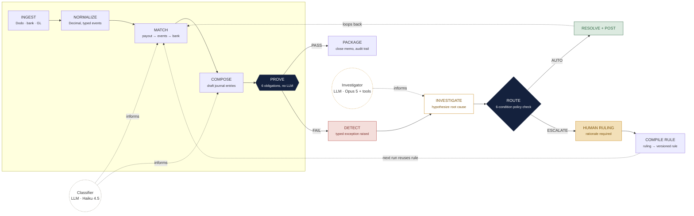
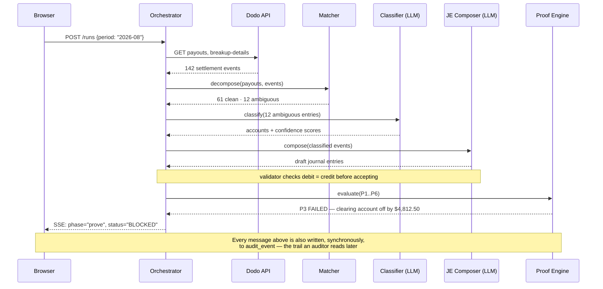
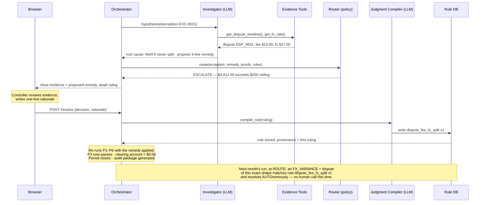

# TieOut — Implementation Plan

**Goal:** Build a close agent that decomposes merchant-of-record settlement payouts into
journal entries, refuses to close a period until a deterministic proof engine confirms the
clearing account is empty, investigates and routes exceptions, and compiles human rulings
into reusable rules.

**Architecture:** A deterministic state-machine spine (Ingest → Normalize → Match → Compose
→ Prove → Package) with two narrow LLM call-outs (Classifier, Investigator) that inform
specific steps but never sit on the spine itself. Every path an LLM output takes back onto
the spine is re-checked by the Proof Engine before anything is allowed to post.

**Tech stack:** Python 3.12 + FastAPI, Postgres (local Docker) via SQLAlchemy 2.0 +
Alembic, Anthropic Messages API (Opus 5 for investigation, Haiku 4.5 for classification),
Next.js 15 + Tailwind + shadcn/ui + Recharts, Server-Sent Events for the live run feed,
Neatlogs SDK for tracing, Dodo Payments test mode as the settlement data source.

**Spec:** [`01-chart-of-accounts.md`](01-chart-of-accounts.md),
[`02-exception-taxonomy.md`](02-exception-taxonomy.md),
[`03-data-model-and-contracts.md`](03-data-model-and-contracts.md),
[`04-demo-script.md`](04-demo-script.md), and the strategy in
`role-you-are-cryptic-noodle.md` — this plan is how those specs get built.

## Global constraints

- **No floats, anywhere.** Every monetary value is Python `Decimal` and Postgres
  `NUMERIC(18,4)`, serialized to JSON as a string, never a number.
- **A language model never computes a final dollar amount.** Only the deterministic engine
  does. LLMs classify, hypothesize, draft structure, and narrate — never arithmetic.
- **Nothing posts to the ledger without a passing proof**, and a period cannot close while
  the clearing account is unproven.
- **Every autonomous action is reversible and attributed** to whoever or whatever made it
  (`agent` / `human` / `rule`).
- **The schema and the three contracts (handler, proof, API) freeze at hour 2.** Everything
  after that builds against them without renegotiating.

---

## 1. The mechanism, in one paragraph

Money arrives from Dodo as one lump payout. TieOut decomposes it, drafts journal entries,
and then runs a check that either lands on exactly zero or doesn't — that check, not the
AI, decides whether the period closes. Every component below exists to feed that check good
information, or to fix what it flags.

## 2. Architecture

TieOut is a **state machine with LLM calls embedded in specific, narrow steps** — not an LLM
deciding what to do next. The orchestrator always knows exactly which phase a run is in.



**Reading the diagram:** the spine (Ingest → Normalize → Match → Compose → Prove → Package)
is entirely deterministic. Two LLMs sit off the spine, connected by dotted "informs" edges:
the Classifier feeds Match and Compose, the Investigator only activates when Prove fails.
No LLM has an edge straight into Package or the ledger — every path back onto the spine
passes through Prove again. That's deliberate: nothing an LLM touches reaches the books
without being re-checked by arithmetic.

### 2.1 Components

| Component | Type | Does | Cannot do |
|---|---|---|---|
| **Close Orchestrator** | State machine | Tracks which phase a run is in, moves it forward | Skip a failed proof; close a blocked period |
| **Ingestor** | Tool | Pulls settlement events from Dodo, bank lines, GL, invoices into one shared shape | Mutate source data |
| **Matcher** | Deterministic engine | Decomposes a payout into its parts, ties it to a bank deposit | Call a model for any arithmetic |
| **Classifier** | LLM · Haiku 4.5 | Assigns a GL account to ambiguous events, with a confidence score | Invent an account or an amount |
| **JE Composer** | LLM + validator | Drafts journal-entry structure | Post an entry that doesn't balance — a separate validator rejects it first |
| **Proof Engine** | Deterministic engine | Runs the six proof obligations (P1–P6) | Be overridden by any agent |
| **Investigator** | LLM · Opus 5 + tools | Forms hypotheses, calls evidence tools, cites a root cause | Edit data; assert an unverified number |
| **Escalation Router** | Policy engine | A six-condition check decides autonomous-resolve vs. escalate | Auto-approve above materiality |
| **Judgment Compiler** | LLM + schema check | Turns a human ruling into a versioned, reusable rule | Change a materiality threshold or a proof |
| **Narrator** | LLM | Writes the close memo in prose | State a figure not sourced from the ledger |

### 2.2 Hard invariants

1. A language model never computes a final dollar amount — only the deterministic engine does.
2. Nothing posts to the ledger without a passing proof.
3. A period cannot close while the clearing account is unproven.
4. Every autonomous action is reversible and attributed to who or what made it.

### 2.3 The exact autonomy check

This is the one piece of logic the whole trust story rests on — a plain function, not a prompt:

```python
def route(exception, remedy, proofs, rules) -> Literal["AUTO", "ESCALATE"]:
    return "AUTO" if all([
        all(p.passed for p in proofs if p.blocking),                  # 1. every proof still passes
        abs(exception.amount) < Decimal("250.00"),                    # 2. under materiality
        exception.confidence >= Decimal("0.85"),                      # 3. classifier is sure
        rules.has_match(exception) or exception.is_known_archetype,   # 4. seen before
        not remedy.touches_restricted_account,                        # 5. no restricted account
        not rounding_cap_breached(remedy),                            # 6. hasn't hit the cap
    ]) else "ESCALATE"
```

All six, every time. One false and it stops and asks a human — never the reverse.

---

## 3. Tech stack

Chosen for two things only: money must never touch a float, and the demo must survive a
dead network connection.

| Layer | Choice |
|---|---|
| Backend | Python 3.12 · FastAPI |
| Money | `Decimal` / `NUMERIC(18,4)` |
| Database | Postgres (local, Docker) |
| ORM | SQLAlchemy 2.0 + Alembic |
| Agents | Anthropic Messages API |
| Investigator | Opus 5 |
| Classifier | Haiku 4.5 |
| Frontend | Next.js 15 + Tailwind |
| Components | shadcn/ui + Recharts |
| Live feed | Server-Sent Events |
| Observability | Neatlogs SDK |
| Data source | Dodo Payments (test mode) |

**Why `Decimal`, not `float`:** floating-point numbers cannot represent most decimal
fractions exactly (`0.1 + 0.2 ≠ 0.3` in binary). One silent rounding error is enough to lose
a judge's trust in a finance product. Every monetary column is `NUMERIC(18,4)` in Postgres
and `Decimal` in Python, end to end, serialized to JSON as a *string* — never a number.

### 3.1 API surface

| Endpoint | Purpose |
|---|---|
| `POST /runs` | Start a close run for a period |
| `GET /runs/{id}/stream` | Live agent activity via SSE — what the demo shows on screen |
| `GET /runs/{id}/proofs` | Pass/fail + the exact dollar delta for each of the six proofs |
| `GET /runs/{id}/exceptions` | The exception register |
| `POST /exceptions/{id}/resolve` | A human ruling — rejects an empty rationale with 422 |
| `GET /rules` | Every learned rule, with the ruling that taught it |
| `GET /runs/{id}/audit-package` | The close memo and its evidence bundle |

Full schema, SSE event shape, and module layout for AO fan-out are in
[`03-data-model-and-contracts.md`](03-data-model-and-contracts.md).

---

## 4. Data model

Twelve tables, grouped by what they represent: source data coming in, the ledger being
written, and the exception/learning loop. That grouping is what makes the proof engine's
job legible.

```mermaid
flowchart LR
    subgraph SRC ["SOURCE DATA"]
        direction TB
        se[settlement_event<br/><small>event_type, amount_native, fx_rate, raw</small>]
        po[payout<br/><small>gross, fees, net, status, bank_line_id</small>]
        bl[bank_line<br/><small>amount, posted_at, matched_payout_id</small>]
        inv[invoice<br/><small>subtotal, tax, total, line_items</small>]
    end

    subgraph LED ["THE LEDGER"]
        direction TB
        ga[gl_account<br/><small>code, name, type, is_restricted</small>]
        je[journal_entry<br/><small>status, created_by: agent/human/rule</small>]
        jl[journal_line<br/><small>debit, credit — exactly one non-zero</small>]
        pr{{proof_result<br/><small>P1–P6, passed, expected, actual, delta</small>}}
    end

    subgraph EXL ["EXCEPTIONS & LEARNING"]
        direction TB
        ex[exception<br/><small>type, confidence, ground_truth_key*</small>]
        hr[human_ruling<br/><small>decision, rationale — required</small>]
        ru[rule<br/><small>predicate, action, source_ruling_id</small>]
    end

    SRC --> LED
    LED -- "on FAIL" --> ex
    ex --> hr --> ru
    ru -. "rule applied next run" .-> LED

    AE[["audit_event — append-only<br/><small>actor · action · subject · payload · timestamp</small><br/><small>every zone writes here; never updated, never deleted</small>"]]
    SRC -.-> AE
    LED -.-> AE
    EXL -.-> AE

    style pr fill:#14213D,stroke:#14213D,color:#fff
    style AE fill:#fff,stroke:#7A705A,stroke-dasharray: 3 3
```



`* ground_truth_key` is write-once by the generator and readable only by the metrics
endpoint — no agent or prompt ever sees it. That separation is what makes an automation-rate
number a measurement instead of a claim.

Two design choices carry the trust story:

- **The rounding account is capped, not trusted.** Dodo pro-rates entries into the payout
  currency, which produces genuine sub-cent residuals. Account `7490` absorbs those — but
  only up to $1.00 per payout and $25.00 per period, checked in code. Breach it, and the
  close blocks. An agent can never bury a real discrepancy there.
- **Ground truth the agent can't see.** `exception.ground_truth_key` links to the manifest
  of exceptions deliberately planted in the test data. Written once by the generator, read
  only by `/metrics`.

Full column-level schema, the `ExceptionHandler` / `ProofObligation` protocol definitions,
and the module-to-branch ownership table are in
[`03-data-model-and-contracts.md`](03-data-model-and-contracts.md) — that document is the
literal contract frozen at hour 2.

---

## 5. Sequence: one close run, start to blocked

This traces a single request through the system — the exact path the demo's "moment" (the
proof failing) takes.



Because $4,812.50 exceeds the $250 materiality ceiling, the run continues into
investigation and escalation rather than resolving on its own — that continuation is traced
next.

## 6. Sequence: investigation, escalation, and the learning loop

Picking up exactly where the run above left off. This is the sequence that makes "it gets
smarter" a real, traceable mechanism rather than a slogan.



One human decision, made once, becomes a durable rule with a paper trail back to the person
who made the call. The only thing that changes between this month and next month is that
the Router's condition 4 ("a matching rule exists") now evaluates true — nothing else about
the pipeline changes.

This is also why the control run matters: Run 2 (September) is executed twice, once with
rules enabled and once with them switched off. The only variable between those two runs is
whether the Router can see the learned rules — which turns "automation went up" from an
anecdote into a measured, isolated effect.

---

## 7. Build sequence

The order below exists because of one dependency: nothing downstream can be built until the
schema and the three contracts (handler, proof, API) are frozen. Once frozen, the six
proofs and fourteen exception handlers are independent of each other — that's what lets two
people, or a fleet of parallel AO coding agents, build them at the same time.

### Phase 1 — Freeze the contract
**Hours 0–2 · both developers**

Write the database schema, the `ExceptionHandler` interface, the `ProofObligation`
interface, and the API shape (all already drafted in
[`03-data-model-and-contracts.md`](03-data-model-and-contracts.md) — this phase is
converting that spec into a running migration + typed interfaces, not designing from
scratch). Nothing here should change again without both people agreeing — every hour after
this depends on it not moving.

**Definition of done:** `alembic upgrade head` runs clean against a fresh Postgres; the
`ExceptionHandler` and `ProofObligation` protocols are importable stub modules; both
developers have read and agreed to the frozen contract.

### Phase 2 — Get real, provable data flowing
**Hours 2–6**

Confirm Dodo test mode actually produces a payout that can be pulled through
`GET /payouts/{id}/breakup`. Build the generator that plants known exceptions into two
periods of test data (August, September) with a written manifest of what should be found in
each.

**Definition of done:** two periods of data exist in the local database; the planted-
exception manifest lists every exception type, its period, and its expected resolution.

### Phase 3 — Build the part that can't be faked: the six proofs
**Hours 6–11 · runs in parallel**

Each proof (P1–P6) is a small, pure function with no model call — this is the trust
foundation, so it's built and tested before anything that depends on it. In parallel: the
payout decomposition (Matcher) and the bank tie-out.

**Definition of done:** a clean period proves to $0.00 on all six obligations; each proof
has a unit test with a deliberate off-by-one-cent case.

### Phase 4 — Teach it to notice problems
**Hours 11–16 · runs in parallel**

Implement the exception handlers, starting with the seven marked "must" in
[`02-exception-taxonomy.md`](02-exception-taxonomy.md) (the ones the demo actually uses)
before the other seven. Each handler ships with a fixture that should trigger it and a
near-miss fixture that deliberately shouldn't.

**Definition of done:** all seven MVP handlers pass their trigger and near-miss fixtures.

### Phase 5 — Wire it end to end
**Hours 16–20 · hard cutoff**

The Investigator agent, the live activity feed (SSE), and the exception queue screen.

**By the end of this window, one full run — ingest through a blocked close — must work.**
Anything not done here gets cut, not rushed.

**Definition of done:** `POST /runs` on the August dataset streams live phases to the
browser and lands on a blocked close with a visible proof failure.

### Phase 6 — Close the loop
**Hours 20–24**

The human approval screen, the Judgment Compiler, and proof that a rule written this run is
actually applied on the next one.

**Definition of done:** resolving EXC-0031 with a rationale produces a versioned rule in
`GET /rules`; re-running the period shows P3 passing and the period closing.

### Phase 7 — Run the actual experiment
**Hours 24–27**

Run August, then September twice — once with the learned rules on, once off. Read whatever
numbers come out. Put them on the metrics screen exactly as measured.

**Definition of done:** three automation-rate numbers exist (Run 1, Run 2 treatment, Run 2
control) and are computed from real handler output against the planted manifest, not typed
in by hand.

### Phase 8 — Rehearse and record
**Hours 27–30**

Run the full demo twice, once with the network disabled, and record a fallback video before
the final hour — a live demo with no backup is the single biggest unforced error a
hackathon team can make.

**Definition of done:** a recorded fallback video exists on disk before hour 29 ends.

---

## 8. Verification

- **Golden dataset test suite** (written in Phase 1, before any handler) — a clean period
  must prove to $0.00 on all six obligations; a period with a planted exception must fail
  the specific expected obligation and no other.
- **Proof engine unit tests** per obligation, including a deliberate off-by-one-cent case.
- **Handler fixtures**: one triggering case and one near-miss per handler.
- **End-to-end**: run both periods, assert automation rate, exception precision/recall
  against the manifest, and that the control run scores lower than the treatment run.
- **Demo rehearsal**, twice, once with the network disabled.

---

*This plan operationalizes the design in [`01-chart-of-accounts.md`](01-chart-of-accounts.md),
[`02-exception-taxonomy.md`](02-exception-taxonomy.md), and
[`03-data-model-and-contracts.md`](03-data-model-and-contracts.md), and builds toward the
demo in [`04-demo-script.md`](04-demo-script.md).*
